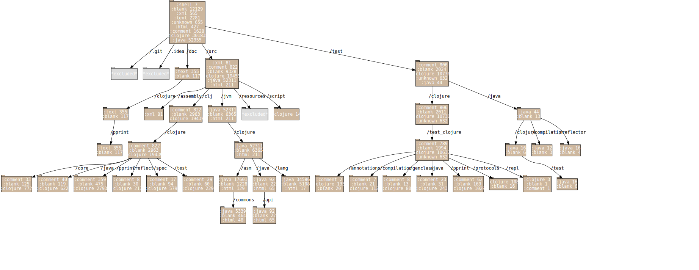

# code-viz

Create visualisations of source code directory structures.

## Usage

*Note* This tool requires graphviz to be installed on your computer.

#### As a commmand line tool

#### As a Clojure library

    (use 'code-viz.core)
    
The function to use is path->svg, which takes the following arguments:

| argument | description |
|----------|-------------|
| path | the path to the root of the (source) directory you wish to visualize. |
| filename | the visualization output file (svg format) |

In addition, there are two optional arguments:

| argument | default | description |
|----------|---------|-------------|
| graphviz-path | 'dot' | the path of the graphviz executable e.g. /opt/bin/dot |
| exclusions | [] | A vector of regexes which if any match a directory name, that directory is not explored furhter |

## License

Copyright © 2019 Jude Payne

Distributed under the MIT License
